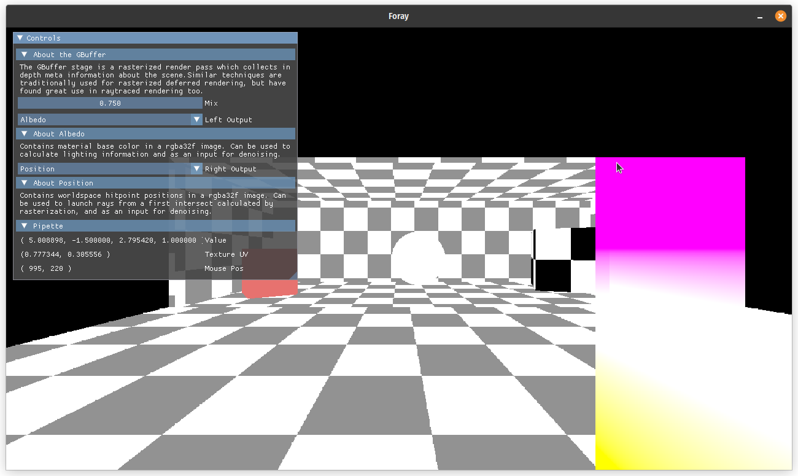
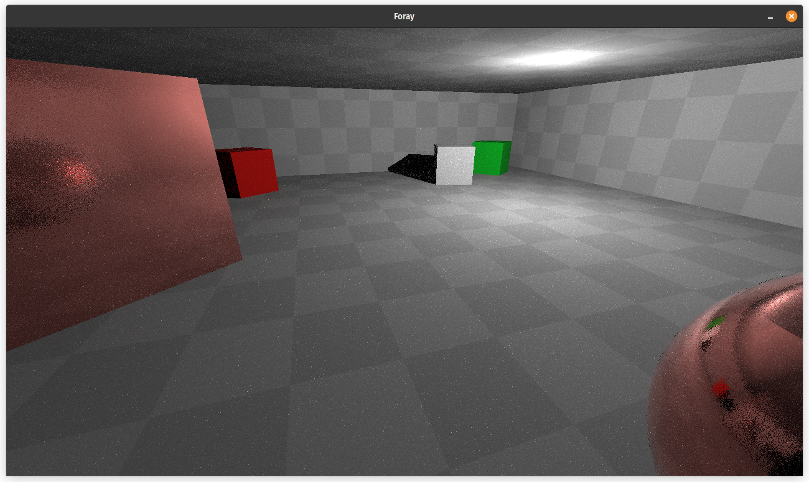

Demos showcasing the capabilities of the Framework for Open Ray Tracing Prototyping *foray*

# Setup

```
git clone --recursive https://github.com/Vulkemp/foray-examples
```
Also clones the submodule `foray` (required).

# Examples
## [GBuffer](./examples/gbuffer/)

* Demonstrates the outputs provided by the GBuffer (Worldspace position & normals, albedo, motion vectors, material indices, mesh instance indices, depth)
* Additionally showcased functions:
    * Comparer Stage (Module for comparing two images side by side)
    * ImGui Stage (Module for [DearImgui](https://github.com/ocornut/imgui) integration)
## [Minimal Ray tracer](./examples/minimal-raytracer/)
* Demonstrates a minimalist raytracing setup
## [Complex Ray tracer](./examples/complex-raytracer/)

* Good use of the material system (glTF)
* Demonstrates use of punctual lights
* Showcases multiple hit groups (light transport rays vs. visibility rays)

# Tested Build Environments
* Linux G++
* Linux Clang
* Windows MSVC
* Windows Clang